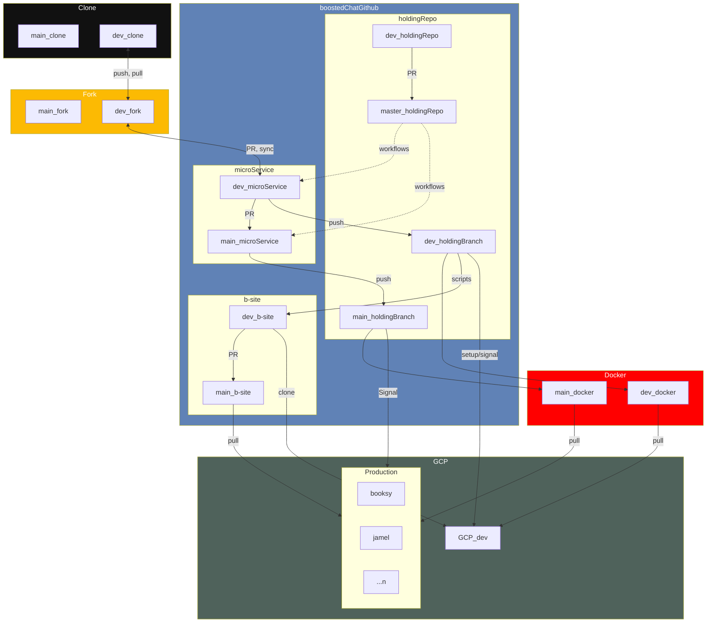

# create-gcloud-vm

CI/CD Pipeline is implemented here.





Work flow to create new instance of boostedchat. This is just meant to test the script, the main set-up is to be done in the core-api.

## Table of Contents
- [Prerequisites](#prerequisites)
  - [Setting up Deploy keys](#setting-up-deploy-keys)
  - [Setting Up Secrets](#setting-up-secrets)
  - [Setting Up gCloud WIF](#setting-up-gcloud-wif)
  - [Setting up cloudflare](#setting-up-cloudflare)
- [Usage](#usage)
  - [Creating new VM](#creating-new-vm)
  - [Linking with boostedchat-site](#linking-with-boostedchat-site)
  - [CD/CI](#cdci)
    - [Setting up the holding repo](#setting-up-the-holding-repo)
    - [Deployments](#deployments)

## Prerequesites
### Setting up Deploy keys
LUNYAMWIDEVS/boostedchat-site is the main repo to be cloned. Since it is private, we require either SSH keys or a personal access token to clone it in the newly created VM. We have choosen to go the SSH way.

Refer to [this guide](https://cpina.github.io/push-to-another-repository-docs/setup-using-ssh-deploy-keys.html#setup-ssh-deploy-keys) on how to create SSH deploy keys and add them to [LUNYAMWIDEVS/boostedchat-site](https://github.com/LUNYAMWIDEVS/boostedchat-site)

### Setting Up Secrets
The `.env` file which is to be used by the new instance as well as the private key from [Setting up Deploy keys](#setting-up-deploy-keys) should be securely stored away in a place accessible by the gh-action.

These will be should be saved in a vm which has already been deployed. Currently the `apiboostedchat-vm us-east1-b` is the one in use.

`.env` goes to `/etc/boostedchat/.env`
`boostedchat-site` private key goes to `/home/boostedchat/.ssh/boostedchat-site.pem`

Boostedchat-site also assumes that there is a public key in `./key.pem` or in `/home/boostedchat/.ssh/key.pem`.

**[⬆ back home](#table-of-contents)**

### Setting Up gCloud WIF

You can obtain the `service_account` and `workload_identity_provider` by running:

```bash
./createGCPCredentials.sh $PROJECT_ID $WORKLOAD_IDENTITY_POOL $PROVIDER $EMAIL $REPO
```
- **PROJECT_ID**: use `gcloud projects list` to get project id
- **WORKLOAD_IDENTITY_POOL**: Check stepwise below on valid values
- **PROVIDER**: Check stepwise below on valid values
- **EMAIL**: email without the domain. Check stepwise below on valid values
- **REPO**: Repo from which the gh-action is to be run. In the format Organization/repo. 

example

```bash
./createGCPCredentials.sh boostedchatapi somepool someprovider email1 "Surgbc/create-gcloud-vm1"
```

Set up `WORKLOAD_IDENTITY_PROVIDER_ID` and `SERVICE_ACCOUNT` repo secrets with the values you have obtained.

Refer to [this article](https://medium.com/google-cloud/how-does-the-gcp-workload-identity-federation-work-with-github-provider-a9397efd7158) for how WIF works.

The procedure is condensed below: 

1. Get the project id. You can use `gcloud projects list` to get the project_id

2. Create workload-identity-pool: `gcloud iam workload-identity-pools create <WORKLOAD_IDENTITY_POOL> --location="global" --project <project_id>`

`WORKLOAD_IDENTITY_POOL` can only consist of digits [0-9], lowercase characters [a-z], dashes [-], and must be between 4 and 32 characters in length.

gcloud iam workload-identity-pools create abc --location="global" --project boostedchatapi
Created workload identity pool [abcde].

3. Create Workload Identity Provider

`PROVIDER` can only consist of digits [0-9], lowercase characters [a-z], dashes [-], and must be between 4 and 32 characters in length.

```
gcloud iam workload-identity-pools providers create-oidc <PROVIDER> \
--location="global" --workload-identity-pool="<WORKLOAD_IDENTITY_POOL>"  \
--issuer-uri="https://token.actions.githubusercontent.com" \
--attribute-mapping="attribute.actor=assertion.actor,google.subject=assertion.sub,attribute.repository=assertion.repository" \
--project <project_id>
```

4. Get the project number
Get project number using: `gcloud projects list |grep "^$PROJECT_ID " | awk '{print $NF}' | tr -d '\n'`

5. Service Account and IAMs
```
gcloud iam service-accounts create <SERVICE-ACCOUNT> \
--display-name="Service account used by WIF POC" \
--project <project_id>

gcloud projects add-iam-policy-binding <project_id> \
--member='serviceAccount:<SERVICE-ACCOUNT>@<project_id>.iam.gserviceaccount.com' \
--role="roles/compute.viewer"

gcloud iam service-accounts add-iam-policy-binding <SERVICE-ACCOUNT>@<project_id>.iam.gserviceaccount.com \
--project=<project_id> \
--role="roles/iam.workloadIdentityUser" \
--member="principalSet://iam.googleapis.com/projects/<project_number>/locations/global/workloadIdentityPools/github-wif-pool/attribute.repository/<REPO>"
```

5. Other permissions

```
gcloud projects add-iam-policy-binding <project_id> \
--member=serviceAccount:<email>@<project_id>.iam.gserviceaccount.com \
--role=roles/compute.instanceAdmin

gcloud iam service-accounts add-iam-policy-binding <email>@<project_id>.iam.gserviceaccount.com \
--role=roles/iam.serviceAccountUser \
--member=serviceAccount:<project_number>-compute@developer.gserviceaccount.com

gcloud iam service-accounts add-iam-policy-binding <project_number>-compute@developer.gserviceaccount.com \
--role=roles/iam.serviceAccountUser \
--member=serviceAccount:<email>@<project_id>.iam.gserviceaccount.com

```
**[⬆ back home](#table-of-contents)**

### Setting up cloudflare

Create also the repo secrets called `CLOUDFLARE_ZONE_ID` and `CLOUDFLARE_API_TOKEN`

## Usage
### Creating new VM

1. You can obtain the `service_account` and `workload_identity_provider` by running:

```bash
./createGCPCredentials.sh $PROJECT_ID $WORKLOAD_IDENTITY_POOL $PROVIDER $EMAIL $REPO
```

See example under [Setting Up gCloud WIF](#setting-up-gcloud-wif)

Set up these as `SERVICE_ACCOUNT` and `WORKLOAD_IDENTITY_PROVIDER_ID` repo secrets respectively.

2. Add vm name to vms file, or make any other change in repo

3. commit with the message "create vm <vm_name>"

```
git add . && git commit -m "create vm <vm_name>"
```

A vm with the name `<vm_name>` will be created when you push the commit.

**[⬆ back home](#table-of-contents)**

### Linking with boostedchat-site

The development of the script is best done and tested independently from the rest of the work in `boostedchat-site`. Integrating it with the rest of the `boostedchat-site` work requires some integration.

For this integration, create for this repo a repo secret called `SSH_DEPLOY_KEY` with the private key obtained in [Setting up Deploy keys](#setting-up-deploy-keys).

To integrate the changes, create a new tag using:

```bash
git tag vx.x.x
git push origin vx.x.x
```

This process pushes the `setupvm.sh` file into the `dev` branch of `site`. It add to it functions which will create `docker-compose.yaml` in the server in case it is a dev setup as well as the two files `watch.sh` and `pullUpdatesImages.sh` which are used for CD/CI.

**[⬆ back home](#table-of-contents)**

### CD/CI
Create repo secrets `DEV_DOCKER_USERNAME`, `DEV_DOCKER_PASSWORD`, `MAIN_DOCKER_USERNAME`, `MAIN_DOCKER_PASSWORD` which are the credentials for the accounts to use for docker in development mode of production. They could refer to the same account though. 

`images.yaml` contains a `build` and `use` which contain respectively the images to build for `dev` and `production (main) ` and the images to use for the services defined for both `dev` and production `setups`. The images in the main section should be the same as those in `docker-compose.yaml` of `-site` repo. For now you have to sync these 2 lists manually.

For now the images to be used in `dev` set-up have to be manually defined in the `docker-compose.yaml` file contained in this repo. The contents of this file are copied to the `setupvm/install.sh` file when deploying to the `-site` repo. That function copies those contents to the `docker-compose.yaml` file on the vm if the environment is set as `dev`.


**[⬆ back home](#table-of-contents)**

#### Setting up the holding repo
We could use a `personal access token` for cloning the repos for which we want to build images. This is be the cleanest way. The other option might be to set up ssh (deploy) keys for all repos that we need to interact with. This is tedious work. The other option is to create build pipelines in each repo. This will involve the management of DOCKER credentials in all these repos, which is also hard work. The other option is to have the individual repos push their work to a holding repo (a deploy key will only be required for the holding repo). Then we can pull from that repo when building. This is the path we have chosen. We will use this same repo as the holding repo.

Therefore a deploy key for this repo is required. Save the key as `HOLDING_REPO` Refer to [Setting up Deploy keys](#setting-up-deploy-keys) on how to do this.

To push code from a microservice repo to the holding repo, use:

```
git tag vx.x.x # to push main branch; or
git tag vx.x.x.x # to push dev branch
```

Then you have to check [deployments](#deployments) to build the images and deploy.

**[⬆ back home](#table-of-contents)**

#### Deployments

Run the following to build the images

```
git add . && git commit -m "build and deploy <env>" #env is either dev/main
```

**[⬆ back home](#table-of-contents)**