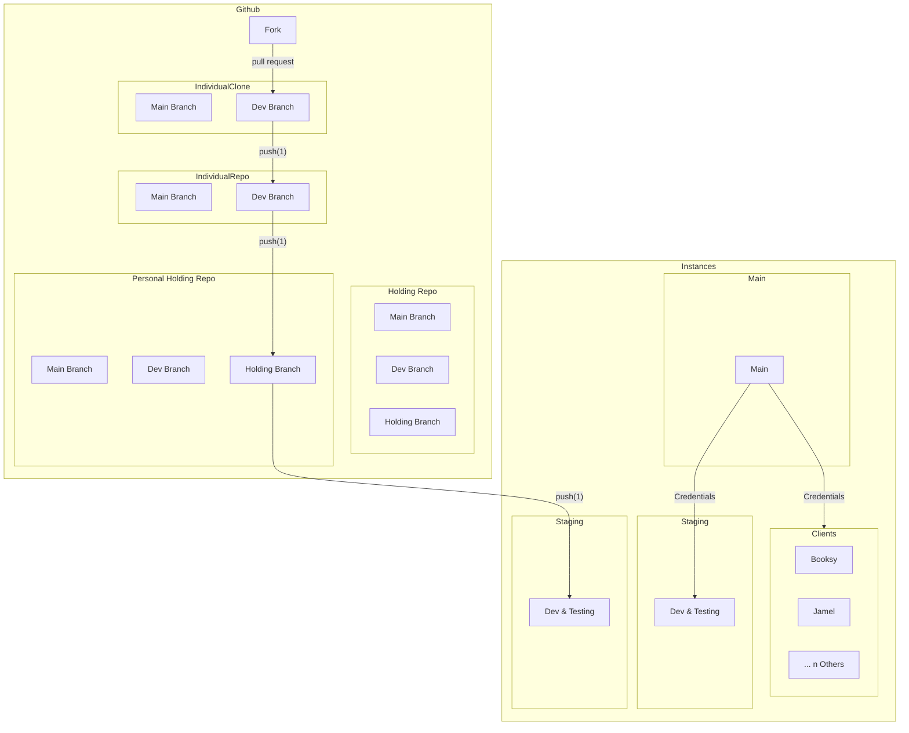
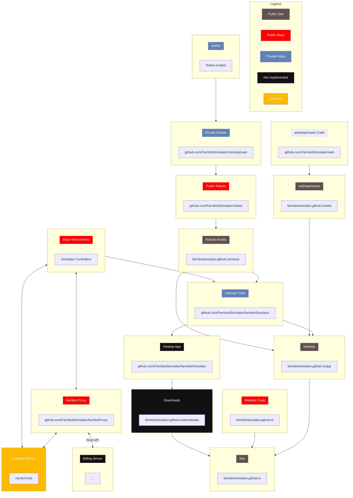
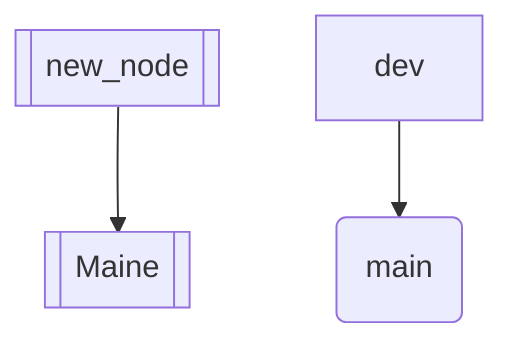

# BoostedChat

## Layout

```mermaid

flowchart TB
    subgraph Instances[Instances]
        subgraph DevelopmentSection[Staging]
            DevelopmentServer[Dev & Testing]
        end
        subgraph PersonalDevelopmentSection[Staging]
            privateDevelopmentServer[Dev & Testing]
        end
        subgraph Clients[Clients]
            Booksy[Booksy]
            Jamel[Jamel]
            Others[Others]
        end
        subgraph Clients[Clients]
            Booksy[Booksy]
            Jamel[Jamel]
            Others[... n Others]
        end
        subgraph MainSection[Main]
            Main[Main]
        end
        Main --Credentials--> DevelopmentServer
        Main --Credentials--> Clients
    end
    subgraph Github[Github]
        subgraph IndividualClone[IndividualClone]
            IndividualMainBranch[Main Branch]
            IndividualDevBranch[Dev Branch]
        end
        subgraph IndividualRepo[IndividualRepo]
            MainBranch[Main Branch]
            DevBranch[Dev Branch]
        end
        Fork
        Fork--pull request-->IndividualDevBranch
        subgraph HoldingRepo[Holding Repo]
            HoldingRepoMainBranch[Main Branch]
            HoldingRepoDevBranch[Dev Branch]
            HoldingBranch[Holding Branch]
        end
        subgraph PersonalHoldingRepo[Personal Holding Repo]
            PersonalHoldingRepoMainBranch[Main Branch]
            PersonalHoldingDevBranch[Dev Branch]
            PersonalHoldingBranch[Holding Branch]
        end
        
        IndividualDevBranch--push(1)-->DevBranch
        DevBranch--push(1)-->PersonalHoldingBranch
        PersonalHoldingBranch--push(1)-->privateDevelopmentServer
        
    end
```

```mermaid
flowchart TB
classDef borderless stroke-width:0px
classDef darkBlue fill:#00008B, color:#fff
classDef brightBlue fill:#6082B6, color:#fff
classDef gray fill:#62524F, color:#fff
classDef gray2 fill:#4F625B, color:#fff
classDef red fill:#f00, color:#fff
classDef green fill:#111, color:#fff
classDef yellow fill:#fcba03, color:#fff

subgraph Legend[Legend]
    Legend1[Public Site]
    Legend2[Public Repo]
    Legend3[Private Repo]
    Legend4[Not implemented]
    Legend5[External]
end
class Legend1 gray
class Legend2 red
class Legend3 brightBlue
class Legend4 green
class Legend5 yellow

subgraph worlds[ ]
    w_A[[worlds<br/> ]]
    w_B[Robot models]
end
class w_A borderless
class worlds,w_A brightBlue
click w_B "https://github.com/brianmechanisms/concepts" _blank

subgraph robotsPrivate[ ]
    rPr_A[[Private Robots<br/> ]]
    rPr_B[github.com/FarmbotSimulator/robotsprivate]
end
class rPr_A borderless
click rPr_B "https://github.com/FarmbotSimulator/robotsprivate" _blank
class robotsPrivate,rPr_A brightBlue
subgraph robotsPublic[ ]
    rPu_A[[Public Robots<br/> ]]
    rPu_B[github.com/FarmbotSimulator/robots]
end
click rPu_B "https://github.com/FarmbotSimulator/robots" _blank
class rPu_A borderless
class robotsPublic,rPu_A red
subgraph robotsAssets[ ]
    rA_A[[Robots Assets<br/> ]]
    rA_B[farmbotsimulator.github.io/robots]
end
class rA_A borderless
class robotsAssets,rA_A gray
click rA_B "https://farmbotsimulator.github.io/robots" _blank

subgraph webApp[ ]
    pU_A[[webApp<br/> ]]
    pU_B[farmbotsimulator.github.io/app]
end
class pU_A borderless
class webApp,pU_A gray
click pU_B "https://farmbotsimulator.github.io/app" _blank

subgraph webAppCode[ ]
    wAC_A[[webApp Code<br/> ]]
    wAC_B[github.com/FarmbotSimulator/farmbotSimulator]
end
class webAppCode,wAC_A brightBlue
click wAC_B "https://github.com/FarmbotSimulator/farmbotSimulator" _blank
class wAC_A borderless
webAppCode-->webApp

subgraph webAppAssets[ ]
    wAA_A[[webAppAssets<br/> ]]
    wAA_B[farmbotsimulator.github.io/web]
end
click wAA_B "https://farmbotsimulator.github.io/web" _blank
class wAA_A borderless
class webAppAssets,wAA_A gray

subgraph webAppAssetsCode[ ]
    wAAC_A[[webAppAssets Code<br/> ]]
    wAAC_B[github.com/FarmbotSimulator/web]
end
click wAAC_B "https://github.com/FarmbotSimulator/web" _blank
class wAAC_A borderless
class webAppAssetsCode red
webAppAssetsCode-->webAppAssets
webAppAssets---->webApp


subgraph site[ ]
    s_A[[Site<br/> ]]
    S_B[farmbotsimulator.github.io]
end
click S_B "https://farmbotsimulator.github.io" _blank
class s_A borderless
class site,s_A gray
subgraph siteCode[ ]
    sC_A[[Website Code<br/> ]]
    SC_B[farmbotsimulator.github.io]
end
click SC_B "https://github.com/FarmbotSimulator/FarmbotSimulator.github.io" _blank
class sC_A borderless
class siteCode,sC_A red
worlds-->robotsPrivate-->robotsPublic-->robotsAssets-->webApp-->site
robotsAssets-->webAppCode
siteCode-->site

subgraph farmbotProxy[ ]
    A3[[farmbot Proxy]]
    B3[github.com/FarmbotSimulator/farmbotProxy]
end
click B3 "https://github.com/FarmbotSimulator/farmbotProxy" _blank
class A3 borderless
class farmbotProxy,A3 red
farmbotProxy<-->farmbotServer

subgraph billingServer[ ]
    bs_A[[Billing Server]]
    bs_B[...]
end
class bs_A borderless
class billingServer,bs_A green


farmbotProxy<--Rest API-->billingServer


subgraph deskopAppCode[ ]
    dAC_A[[Deskop App<br/> ]]
    dAC_B[github.com/FarmbotSimulator/farmbotSimulator]
end
class deskopAppCode,dAC_A green
class dAC_A borderless
webAppCode-->deskopAppCode-->downloads-->site

subgraph downloads[ ]
    dn_A[[Downloads<br/> ]]
    dn_B[farmbotsimulator.github.io/downloads]
end
click dn_B "https://farmbotsimulator.github.io/downlods" _blank
class dn_A borderless
class downloads,dn_A green


subgraph brianMechanisms[ ]
    BM_A[[Brian Mechanisms<br/> ]]
    BM_B[Simulator Controllers]
end
click BM_B "https://github.com/FarmbotSimulator/brian-mechanisms" _blank
class BM_A borderless
class brianMechanisms,BM_A red
brianMechanisms-->webAppCode
brianMechanisms<---->farmbotProxy


subgraph farmbotServer[ ]
    fS_A[[Farmbot Server<br/> ]]
    fS_B[my.farm.bot]
end
click fS_B "https://my.farm.bot/" _blank
class fS_A borderless
class farmbotServer,fS_A yellow
brianMechanisms<-->farmbotServer


```

## Roadmap

```mermaid

flowchart TB
  node_1("main")
  node_2[["Maine"]]
  node_3[["new_node"]]
  node_4["dev"]
  node_3 --> node_2
  node_4 --> node_1

```